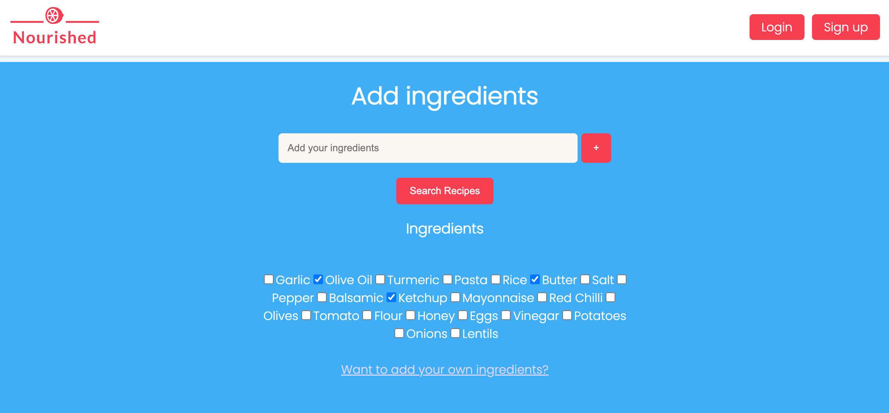

# Nourished

"Nourished" is a web-based application for users to find recipes based on the ingredients they have at home. This application helps reduce food waste and makes cooking more accessible.
Elias Khourry, Dominik Michel and Karan Dwivedi have co-created this application. This project was built during week 9 of General Assembly's Software Engineering Immersive Bootcamp. The brief involved creating a web application using a stack / language / library of choice. Students were given freedom to choose a topic / problem they would like to solve with their application.
 

## Login

-   Uses firebase Authentication and encryption to protect user password and email.
-   Google signin function has been implemented as well so the user can sign in directly with their gmail account through a popup menu.
-   Onced logged in, users can add a name for their account as well as personiliased ingredients.
     

## Homepage

-   Shows a list of recipes on default page load
-   User can type ingredients in the search bar and add them
-   The user can select Pantry items, these pantry items are saved in local storage
    -User can click on 'search for recipes'
    -A list of recipes are shown in a horizontal scroll list
-   This search is based on Pantry and ingredients inputs
     

## Result page

-   Shows a list of recipes the user could make with the exact ingredients inputted
    -Search can be updated if the user changes ingredients
    -Instructions on how to cook are displayed once a dish link is clicked
    -Wine pairings added based on dish
     

## Features

1. Sign in (with google sign in included)/Sign out
2. Create users profile
   3.Add favourite / most used food to user profile and save
3. Pantry items are saved in local storage
4. Add fresh ingredients in user field
5. Search for Recipes
    - Search button brings the user on a new page with matching Results/Recipes
       

## Tools, Gems and APIs used

Ruby on rails was the main tool used to create this web application.

-   FireBase for backend
-   React for front end
-   CSS - Done from scratch
-   APIs: REACT-DOM-ROUTER, Firebase, Bootstrap for alerts
-   Spoonacular - Nutrition, Recipe, and Food API (edited)
